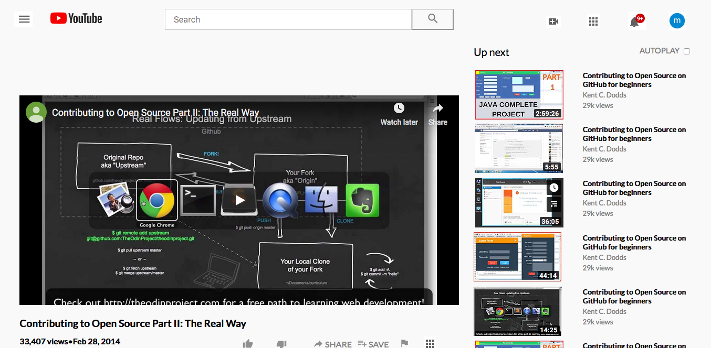

# Project Name

> Welcome to our first html and css project. Developed by Alvaro Ruiz (@alvarorf) and Miguel Enciso (@rootDEV2990). Please enjoy and leave us a comment. 

Additional description about the project and its features.

## Built With

- HTML,
- CSS,
- Coffee 

## Live Demo

[Live Demo Link](Comming soon!!)

## Getting Started

Simply download the zip and decompress. Once decompressed, double click or open index.html in any web browser. 

To get a local copy up and running follow these simple example steps.

### Prerequisites

Any web browser will do, Mozilla, Safari, or Chrome. 

### Setup

None needed drecompress and drag and drop onto browser. 

### Install

None needed. 

### Usage

Development playground. 

### Run tests

Text editor any IDE.

### Deployment

Localhost. 

## Authors

👤 **Alvaro Ruiz**

- Github: [@githubhandle](https://github.com/alvarorf)
- Twitter: [@twitterhandle](https://twitter.com/aaruizf)
- Linkedin: [linkedin](https://www.linkedin.com/in/alvaro-r-22810915a/)

👤 **Author2**

- Github: [@githubhandle](https://github.com/rootDEV2990)
- Twitter: [@twitterhandle](https://twitter.com/m29902)
- Linkedin: [linkedin](https://www.linkedin.com/in/miguel-enciso-6474741a1/)

## 🤝 Contributing

Contributions, issues and feature requests are welcome!

Feel free to check the [issues page](issues/).

## Show your support

Give a ⭐️ if you like this project!

## Acknowledgments

- Hat tip to anyone whose reads this code.
- Inspiration, coffee and code. 
- BTC donations accepted. 

## 📝 License

This project is for microverse course purposes.
